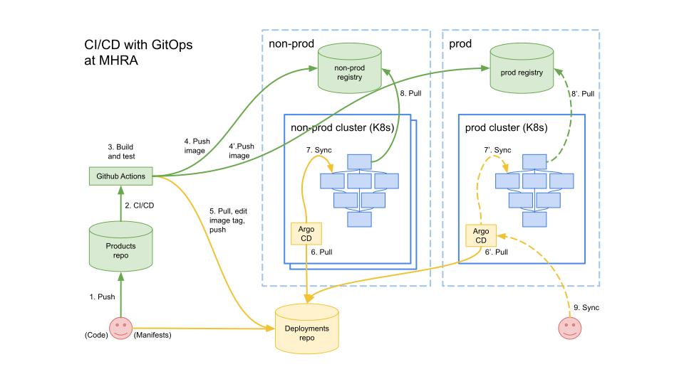

# Deployments repo

This repo contains all the manifests for resources running under [Kubernetes](https://kubernetes.io/) (with [Istio](https://istio.io/)) at MHRA. It declares our intent, and then we use [GitOps](https://www.weave.works/technologies/gitops/) to realise this deployment configuration using [ArgoCD](https://argoproj.github.io/argo-cd/). Note that all secrets in this repo are encrypted using [Bitnami's Sealed Secrets](https://github.com/bitnami-labs/sealed-secrets).



1. An engineer pushes a change to the [Products monorepo](https://github.com/MHRA/products)
1. A [Github Action](https://github.com/features/actions) runs a workflow
1. The workflow builds a Docker image, which also runs analysis and tests
1. The workflow pushes the image to the relevant registry
1. The workflow clones _this_ repository (shallow clone), uses [Kustomize](https://kustomize.io/) to edit the relevant configuration with the new image's tag (which is the image's content digest [SHA]), commits and pushes back to this repository
1. Argo CD running in the cluster pulls the changed configuration
1. Argo CD synchronises the configuration of the cluster with the configuration specified in _this_ repository
1. If required, new images are pulled (by Kubernetes) from the relevant registry and new pods started
1. Production deployments can be manually synced (although the aim is to have these automatically synchronised as well)

## Creating a cluster from scratch

1. Follow the [steps in the products repo](https://github.com/MHRA/products/tree/master/infrastructure) to set up a Kubernetes cluster on Azure using terraform.

1. Install Istio, Sealed Secrets and ArgoCD. Once installed, ArgoCD will deploy the rest of the configuration (using GitOps). The `overlay` argument specifies the environment you are deploying to (the default is `non-prod`):

   ```sh
   cd cluster-init

   make overlay=non-prod
   ```

## Deleting the cluster

1. If you only want to delete Istio, Sealed Secrets, Argo CD:

   ```sh
   cd cluster-init

   make delete overlay=non-prod
   ```

1. If you want to delete the cluster infrastructure for your environment [you can do this from the products repo](https://github.com/MHRA/products/tree/master/infrastructure/docs/destroy-provision-aks.md).

---

## Useful tools for working with this repo

1. `kubectl` - The official client for the Kubernetes API

   https://kubernetes.io/docs/reference/kubectl/overview/

   ```sh
   brew install kubernetes-cli
   ```

   It may be useful to alias this to something easier to type (and maybe add to your shell rc, e.g. `~/.zshrc`).

   ```sh
   alias k=kubectl
   ```

   There's also a `zsh` plugin for `kubectl` for your `~/.zshrc`, e.g.:

   ```sh
   plugins=(git kubectl zsh-syntax-highlighting)
   ```

1. `kustomize` - create a set of manifests for Kubernetes

   https://kustomize.io/

   ```sh
   brew install kustomize
   ```

1. `kubectx` - tools for switching K8s contexts (clusters) and namespaces

   https://kubectx.dev/

   ```sh
   brew install kubectx
   ```

   It may be useful to alias these tools to something easier to type (and maybe add to your shell rc, e.g. `~/.zshrc`).

   ```sh
   alias kctx=kubectx
   alias kns=kubens
   ```

   You should be able to use `Tab` autocompletion with `kctx` on contexts from your `~/.kube/config`, and with `kns` on namespaces from the current context. Really useful for quickly changing clusters/namespaces.

1. `kube-ps1` - customize your command prompt to display the current context and namespace

   https://github.com/jonmosco/kube-ps1

   ```sh
   brew install kube-ps1
   ```

   And for your `~/.zshrc` ...

   ```sh
   source "/usr/local/opt/kube-ps1/share/kube-ps1.sh"
   PS1='$(kube_ps1)'$PS1
   ```

1. `stern` - easily tail container logs

   https://github.com/wercker/stern

   ```sh
   brew install stern
   ```

   Aggregates logs from all containers whose names match the pattern, e.g. tailing logs from `istio-ingressgateway`:

   ```sh
   kns istio-system && stern ingress
   ```

1. `istioctl` - official client for the Istio API

   https://istio.io/docs/reference/commands/istioctl/

   ```sh
   brew install istioctl
   ```

1. `kubeseal` - Bitnami Sealed Secrets CLI

   https://github.com/bitnami-labs/sealed-secrets

   ```sh
   brew install kubeseal
   ```

   This is used by some of the scripts/Makefiles in this repo to encrypt secrets so that they can be committed to this repo.

1. `kind` - Kubernetes In Docker

   https://kind.sigs.k8s.io/

   ```sh
   brew install kind
   ```

   Useful for creating a local multi-node cluster for testing configurations.

1. `argocd` - official cli for working with ArgoCD

   ```sh
   brew install argocd
   ```

   Your mileage may vary, and you may need to use port-forwarding (or grpc-web) for this to be useful, because we use Istio ingress gateway. It's probably easier to use the web gui.

1. `helm` - manage templating and installation of helm charts

   ```sh
   brew install helm
   ```

   Currently used to configure the cert-manager.
